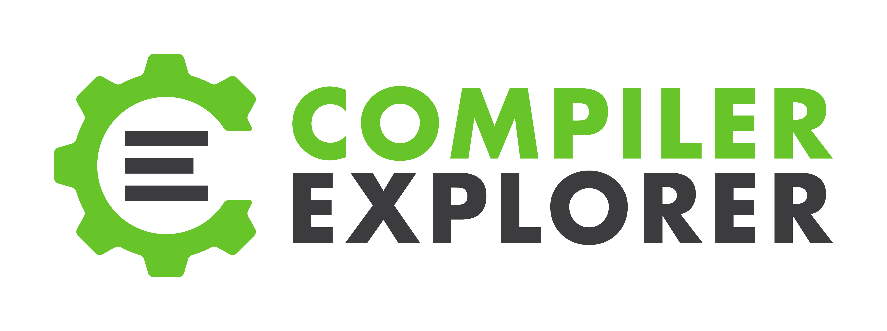

## About me

- Games
- C++ Tools
- Google
- Finance

---

---

"GCC Explorer" 22nd March 2012

---

  

    <h3>2012</h3>
    <ul>
      <li>gcc &amp; clang</li>
      <li>C++</li>
      <!-- wayback listed 15 compilers including icc by May 2012
      https://web.archive.org/web/20120525042912/http://gcc.godbolt.org/ -->
      <li>Unfiltered</li>
      <li>5k lines of JavaScript</li>
      <li>Just me!</li>
      <li>Self-funded</li>
    </ul>
  

  

    <h3>2025</h3>
    <ul>
      <li>5,000+ compilers (1026 C++)</li>
      <li>80+ languages</li>
      <li>Filters, tools, diffs...</li>
      <li>120k lines of TypeScript</li>
      <li>Amazing team</li>
      <li>Patrons &amp; sponsors</li>
    </ul>
  

  

  
  

---

---

[stats.compiler-explorer.com](https://stats.compiler-explorer.com/)

---

## Running costs

- $3,100 / month
- $0.00039 / compilation (0.039 cents)
- $2500 AWS / $500 other

More info: [xania.org](https://xania.org/202506/compiler-explorer-cost-transparency)
